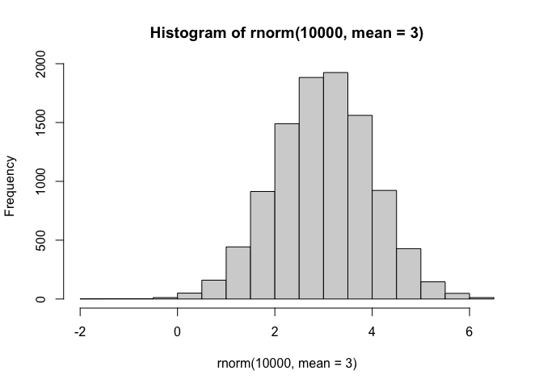
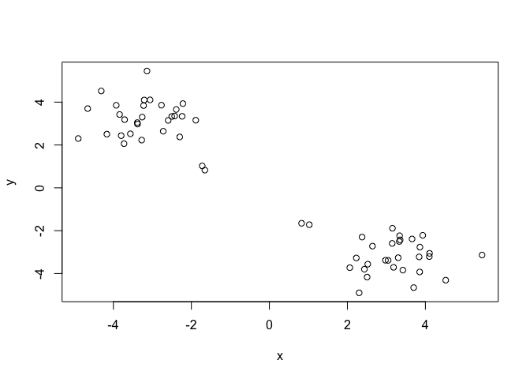
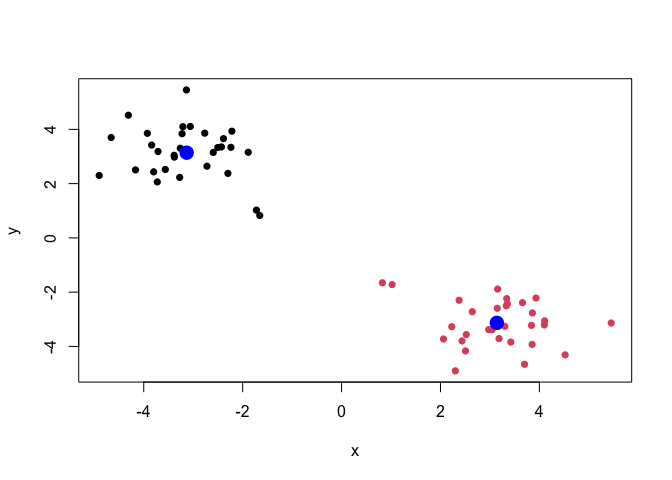
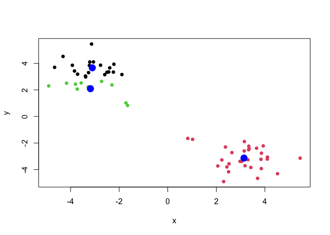
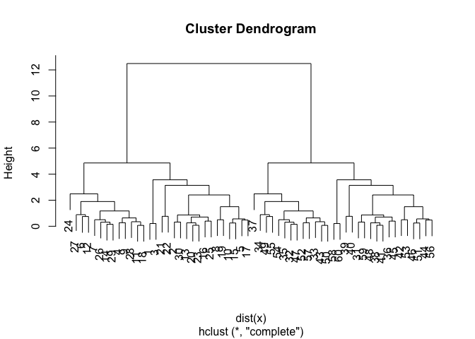
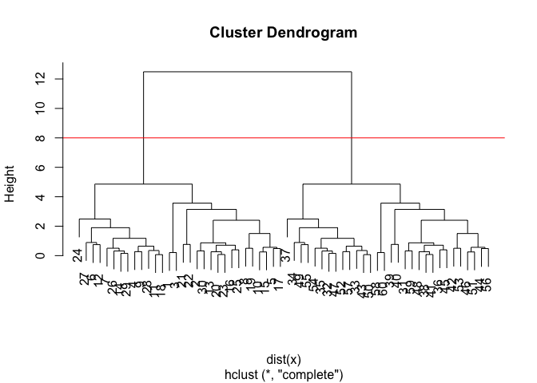
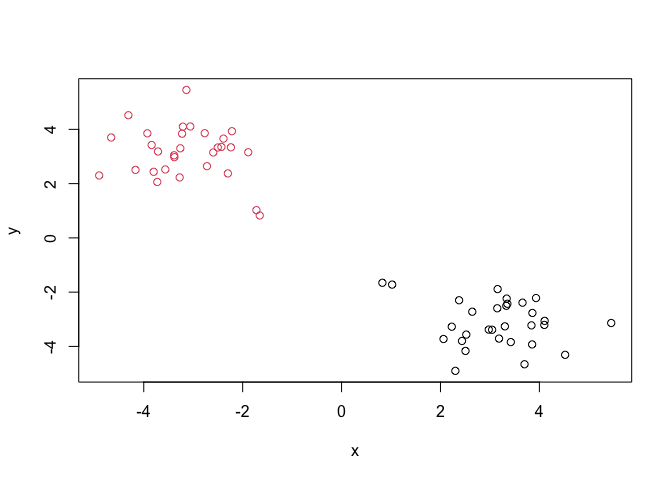

# Class 07: Machine Learning 1
Brian Wells (PID: A69026838)

\#Clustering

We will start with k-means clustering, one of the most prevelent of all
clustering methods.

To get started, let’s make some data up:

``` r
#rnorm() gives random numbers pulled from a normal dist. can shift center by changing mean.
hist(rnorm(10000, mean = 3))
```



Now let’s make 2 rows of 30 numbers cen

``` r
tmp <- c(rnorm(30, 3), rnorm(30,-3))
x <- cbind(x = tmp, y = rev(tmp))
plot(x)
```



The main function in R for K-means clusting is called `kmeans()`.

``` r
k <- kmeans(x, centers=2, nstart=20)
k
```

    K-means clustering with 2 clusters of sizes 30, 30

    Cluster means:
              x         y
    1 -3.131956  3.139923
    2  3.139923 -3.131956

    Clustering vector:
     [1] 2 2 2 2 2 2 2 2 2 2 2 2 2 2 2 2 2 2 2 2 2 2 2 2 2 2 2 2 2 2 1 1 1 1 1 1 1 1
    [39] 1 1 1 1 1 1 1 1 1 1 1 1 1 1 1 1 1 1 1 1 1 1

    Within cluster sum of squares by cluster:
    [1] 47.39244 47.39244
     (between_SS / total_SS =  92.6 %)

    Available components:

    [1] "cluster"      "centers"      "totss"        "withinss"     "tot.withinss"
    [6] "betweenss"    "size"         "iter"         "ifault"      

> Q1. How many points are in each cluster?

``` r
k$size
```

    [1] 30 30

> Q2. The clustering result i.e. membership vector?

``` r
k$cluster
```

     [1] 2 2 2 2 2 2 2 2 2 2 2 2 2 2 2 2 2 2 2 2 2 2 2 2 2 2 2 2 2 2 1 1 1 1 1 1 1 1
    [39] 1 1 1 1 1 1 1 1 1 1 1 1 1 1 1 1 1 1 1 1 1 1

> Q3. Cluster centers

``` r
k$centers
```

              x         y
    1 -3.131956  3.139923
    2  3.139923 -3.131956

> Q4. Make a plor of our data colored by clustering results with
> optionally the cluster ceneters shown.

``` r
plot(x, col=k$cluster, pch=16)
points(k$centers, col="blue", pch=16, cex=2)
```



> Q5. Run kmeans again but cluster into 3 groups and plot the results
> like we did above.

``` r
k3 <- kmeans(x, centers=3, nstart=20)
plot(x, col=k3$cluster, pch=16)
points(k3$centers, col="blue", pch=16, cex=2)
```



k-means will always return a clustering result - even if there is no
clear groupings

# Hierarchical Clustering

Hierarchical clustering it has an advantage in that it can reveal the
structure in your data rather than imposing a structure as k-means will

The main function in “base” R is called `hclust()`

It requires a distance matrix, using `dist()`, as input, not the raw
data itself.

``` r
hc <- hclust(dist(x))
hc
```


    Call:
    hclust(d = dist(x))

    Cluster method   : complete 
    Distance         : euclidean 
    Number of objects: 60 

``` r
plot(hc)
```



``` r
plot(hc)
abline(h=8, col="red")
```



The function to get our clusters/groups from a hclust object is called
`cutree()`

``` r
grps <- cutree(hc, h=8)
grps
```

     [1] 1 1 1 1 1 1 1 1 1 1 1 1 1 1 1 1 1 1 1 1 1 1 1 1 1 1 1 1 1 1 2 2 2 2 2 2 2 2
    [39] 2 2 2 2 2 2 2 2 2 2 2 2 2 2 2 2 2 2 2 2 2 2

> Q. Plot our hclust results in terms of our data colored by cluster
> membership.

``` r
plot(x, col=grps)
```



# Principal Component Analysis (PCA)

``` r
url <- "https://tinyurl.com/UK-foods"
x <- read.csv(url)
head(x)
```

                   X England Wales Scotland N.Ireland
    1         Cheese     105   103      103        66
    2  Carcass_meat      245   227      242       267
    3    Other_meat      685   803      750       586
    4           Fish     147   160      122        93
    5 Fats_and_oils      193   235      184       209
    6         Sugars     156   175      147       139

> Q1. first we’ll read the data and see the dimenstions of the df with
> `dim()`

``` r
dim(x)
```

    [1] 17  5

use `head()` to pull the first 6 rows

``` r
head(x)
```

                   X England Wales Scotland N.Ireland
    1         Cheese     105   103      103        66
    2  Carcass_meat      245   227      242       267
    3    Other_meat      685   803      750       586
    4           Fish     147   160      122        93
    5 Fats_and_oils      193   235      184       209
    6         Sugars     156   175      147       139

now lets remove the pesky first column

``` r
# Note how the minus indexing works
rownames(x) <- x[,1]
x <- x[,-1]
head(x)
```

                   England Wales Scotland N.Ireland
    Cheese             105   103      103        66
    Carcass_meat       245   227      242       267
    Other_meat         685   803      750       586
    Fish               147   160      122        93
    Fats_and_oils      193   235      184       209
    Sugars             156   175      147       139

now lets see if we have 4 columns

``` r
dim(x)
```

    [1] 17  4

an alternate method:

``` r
x <- read.csv(url, row.names=1)
head(x)
```

                   England Wales Scotland N.Ireland
    Cheese             105   103      103        66
    Carcass_meat       245   227      242       267
    Other_meat         685   803      750       586
    Fish               147   160      122        93
    Fats_and_oils      193   235      184       209
    Sugars             156   175      147       139

> Q2. Which approach to solving the ‘row-names problem’ mentioned above
> do you prefer and why? Is one approach more robust than another under
> certain circumstances?

The first way isn’t great because you’re overwriting yourself. every
time you run the code, you lose a column. It’s destructive. The second
method is way better.

Now let’s check out a bar plot

``` r
barplot(as.matrix(x), beside=T, col=rainbow(nrow(x)))
```


> Q3: Changing what optional argument in the above barplot() function
> results in the following plot?

Changing the “beside” value to F works!

``` r
barplot(as.matrix(x), beside=F, col=rainbow(nrow(x)))
```


> Q5. Generating all pairwise plots may help somewhat. Can you make
> sense of the following code and resulting figure? What does it mean if
> a given point lies on the diagonal for a given plot?

``` r
pairs(x, col=rainbow(10), pch=16)
```


Each country is being compared to every other country. For example, the
top row is comparing england on the y-axis, the first column is
comparing other contries to England on the x-axis. The more the points
fit with the diagonal line, the more similar the values are between the
two countries.

> Q6. What is the main differences between N. Ireland and the other
> countries of the UK in terms of this data-set?

Whatever that blue dot is (i think fresh fruit)!

# PCA to the rescue

hlep me make sense of this data… The main function for PCA in base R is
called `prcomp()`

It wants the transpose (with the `t()`)of our food data for analysis

``` r
pca <- prcomp(t(x))
summary(pca)
```

    Importance of components:
                                PC1      PC2      PC3       PC4
    Standard deviation     324.1502 212.7478 73.87622 2.921e-14
    Proportion of Variance   0.6744   0.2905  0.03503 0.000e+00
    Cumulative Proportion    0.6744   0.9650  1.00000 1.000e+00

> Q7. Complete the code below to generate a plot of PC1 vs PC2. The
> second line adds text labels over the data points.

``` r
# Plot PC1 vs PC2
plot(pca$x[,1], pca$x[,2], xlab="PC1", ylab="PC2", xlim=c(-270,500))
text(pca$x[,1], pca$x[,2], colnames(x))
```


One of the main results that we look for is called the “score plot” aka
PC plot, PC1 vs PC2 plot…

> Q8. Customize your plot so that the colors of the country names match
> the colors in our UK and Ireland map and table at start of this
> document.

``` r
plot(pca$x[,1], pca$x[,2], xlab="PC1", ylab="PC2", xlim=c(-270,500))
text(pca$x[,1], pca$x[,2], colnames(x), col=c("orange","red","blue","darkgreen"))
```


Below we can use the square of pca\$sdev , which stands for “standard
deviation”, to calculate how much variation in the original data each PC
accounts for.

``` r
v <- round( pca$sdev^2/sum(pca$sdev^2) * 100 )
v
```

    [1] 67 29  4  0

``` r
# or the second row here
z <- summary(pca)
z$importance
```

                                 PC1       PC2      PC3          PC4
    Standard deviation     324.15019 212.74780 73.87622 2.921348e-14
    Proportion of Variance   0.67444   0.29052  0.03503 0.000000e+00
    Cumulative Proportion    0.67444   0.96497  1.00000 1.000000e+00

now lets put this into a bar plot

``` r
barplot(v, xlab="Principal Component", ylab="Percent Variation")
```


``` r
## Lets focus on PC1 as it accounts for > 90% of variance 
par(mar=c(10, 3, 0.35, 0))
barplot( pca$rotation[,1], las=2 )
```


> Q9: Generate a similar ‘loadings plot’ for PC2. What two food groups
> feature prominantely and what does PC2 maninly tell us about?

``` r
par(mar=c(10, 3, 0.35, 0))
barplot( pca$rotation[,2], las=2 )
```


The two food groups in question are fresh potatoes and soft drinks. The
take away is that Wales eats more fresh potatoes and drinks far more
soft drinks than the other countries.
