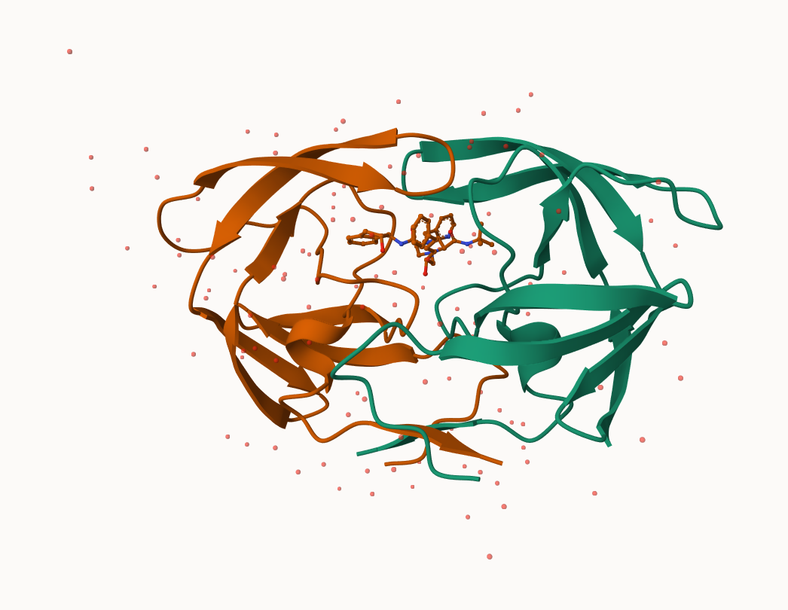
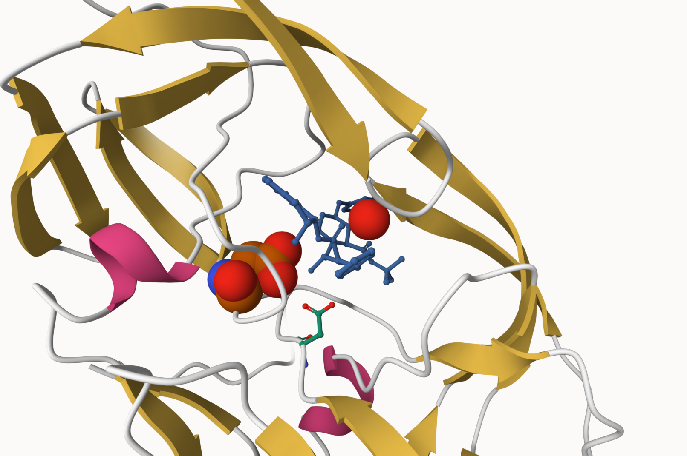

# Class 10
Brian Wells (PID: A69026838)

``` r
string <- c("10", "100", 1, "1,000")
as.numeric(string)+1
```

    Warning: NAs introduced by coercion

    [1]  11 101   2  NA

> Q. Write a function to fix this non numeric table

``` r
x <- string
as.numeric(gsub(",","", x))
```

    [1]   10  100    1 1000

``` r
data.file <- "Data Export Summary.csv"
stats <- read.csv(data.file, row.names=1)
head(stats)
```

                              X.ray     EM    NMR Multiple.methods Neutron Other
    Protein (only)          158,844 11,759 12,296              197      73    32
    Protein/Oligosaccharide   9,260  2,054     34                8       1     0
    Protein/NA                8,307  3,667    284                7       0     0
    Nucleic acid (only)       2,730    113  1,467               13       3     1
    Other                       164      9     32                0       0     0
    Oligosaccharide (only)       11      0      6                1       0     4
                              Total
    Protein (only)          183,201
    Protein/Oligosaccharide  11,357
    Protein/NA               12,265
    Nucleic acid (only)       4,327
    Other                       205
    Oligosaccharide (only)       22

``` r
rm.comma <- function(x) {
  as.numeric(gsub(",", "", x))
}

statsn <- apply(stats, 2, rm.comma)
head(statsn)
```

          X.ray    EM   NMR Multiple.methods Neutron Other  Total
    [1,] 158844 11759 12296              197      73    32 183201
    [2,]   9260  2054    34                8       1     0  11357
    [3,]   8307  3667   284                7       0     0  12265
    [4,]   2730   113  1467               13       3     1   4327
    [5,]    164     9    32                0       0     0    205
    [6,]     11     0     6                1       0     4     22

``` r
rownames(statsn) <- rownames(stats)
statsn
```

                             X.ray    EM   NMR Multiple.methods Neutron Other
    Protein (only)          158844 11759 12296              197      73    32
    Protein/Oligosaccharide   9260  2054    34                8       1     0
    Protein/NA                8307  3667   284                7       0     0
    Nucleic acid (only)       2730   113  1467               13       3     1
    Other                      164     9    32                0       0     0
    Oligosaccharide (only)      11     0     6                1       0     4
                             Total
    Protein (only)          183201
    Protein/Oligosaccharide  11357
    Protein/NA               12265
    Nucleic acid (only)       4327
    Other                      205
    Oligosaccharide (only)      22

of all of the protein sequences on pdb(251,600,768), only 183201 have
been experimentally determined

``` r
round(183201/251600768*100,2)
```

    [1] 0.07

> Q1: What percentage of structures in the PDB are solved by X-Ray and
> Electron Microscopy.

``` r
(sum(statsn[,1]) + sum(statsn[,2]))/sum(statsn[,7])*100
```

    [1] 93.15962

``` r
totals <- apply(statsn, 2, sum)
round(totals/totals["Total"]*100,2)
```

               X.ray               EM              NMR Multiple.methods 
               84.83             8.33             6.68             0.11 
             Neutron            Other            Total 
                0.04             0.02           100.00 

> Q2: What proportion of structures in the PDB are protein?

``` r
sum(statsn[1:3,7])/sum(statsn[,7])
```

    [1] 0.9784556

> Q3: Type HIV in the PDB website search box on the home page and
> determine how many HIV-1 protease structures are in the current PDB?

I found 211,377 examples.

\#pdb format



> Q4: Water molecules normally have 3 atoms. Why do we see just one atom
> per water molecule in this structure?

That is because the hydrogen is hidden, you can only see the oxygen.
This is because the resolution is 2 angstrom, Hydrogen is only 1 A.

> Q5: There is a critical “conserved” water molecule in the binding
> site. Can you identify this water molecule? What residue number does
> this water molecule have

Yes, HOH308

> Q6: Generate and save a figure clearly showing the two distinct chains
> of HIV-protease along with the ligand. You might also consider showing
> the catalytic residues ASP 25 in each chain and the critical water (we
> recommend “Ball & Stick” for these side-chains). Add this figure to
> your Quarto document. Discussion Topic: Can you think of a way in
> which indinavir, or even larger ligands and substrates, could enter
> the binding site?



\#3. Introduction to Bio3D in R

``` r
library(bio3d)
pdb <- read.pdb("1hsg")
```

      Note: Accessing on-line PDB file

``` r
pdb
```


     Call:  read.pdb(file = "1hsg")

       Total Models#: 1
         Total Atoms#: 1686,  XYZs#: 5058  Chains#: 2  (values: A B)

         Protein Atoms#: 1514  (residues/Calpha atoms#: 198)
         Nucleic acid Atoms#: 0  (residues/phosphate atoms#: 0)

         Non-protein/nucleic Atoms#: 172  (residues: 128)
         Non-protein/nucleic resid values: [ HOH (127), MK1 (1) ]

       Protein sequence:
          PQITLWQRPLVTIKIGGQLKEALLDTGADDTVLEEMSLPGRWKPKMIGGIGGFIKVRQYD
          QILIEICGHKAIGTVLVGPTPVNIIGRNLLTQIGCTLNFPQITLWQRPLVTIKIGGQLKE
          ALLDTGADDTVLEEMSLPGRWKPKMIGGIGGFIKVRQYDQILIEICGHKAIGTVLVGPTP
          VNIIGRNLLTQIGCTLNF

    + attr: atom, xyz, seqres, helix, sheet,
            calpha, remark, call

> Q7: How many amino acid residues are there in this pdb object?

198

> Q8: Name one of the two non-protein residues?

HOH

> Q9: How many protein chains are in this structure?

2

``` r
attributes(pdb)
```

    $names
    [1] "atom"   "xyz"    "seqres" "helix"  "sheet"  "calpha" "remark" "call"  

    $class
    [1] "pdb" "sse"

``` r
head(pdb$atom$resid)
```

    [1] "PRO" "PRO" "PRO" "PRO" "PRO" "PRO"

\#Predicting functional motions of a single structure

``` r
adk <- read.pdb("6s36")
```

      Note: Accessing on-line PDB file
       PDB has ALT records, taking A only, rm.alt=TRUE

``` r
adk
```


     Call:  read.pdb(file = "6s36")

       Total Models#: 1
         Total Atoms#: 1898,  XYZs#: 5694  Chains#: 1  (values: A)

         Protein Atoms#: 1654  (residues/Calpha atoms#: 214)
         Nucleic acid Atoms#: 0  (residues/phosphate atoms#: 0)

         Non-protein/nucleic Atoms#: 244  (residues: 244)
         Non-protein/nucleic resid values: [ CL (3), HOH (238), MG (2), NA (1) ]

       Protein sequence:
          MRIILLGAPGAGKGTQAQFIMEKYGIPQISTGDMLRAAVKSGSELGKQAKDIMDAGKLVT
          DELVIALVKERIAQEDCRNGFLLDGFPRTIPQADAMKEAGINVDYVLEFDVPDELIVDKI
          VGRRVHAPSGRVYHVKFNPPKVEGKDDVTGEELTTRKDDQEETVRKRLVEYHQMTAPLIG
          YYSKEAEAGNTKYAKVDGTKPVAEVRADLEKILG

    + attr: atom, xyz, seqres, helix, sheet,
            calpha, remark, call

``` r
# Perform flexiblity prediction
m <- nma(adk)
```

     Building Hessian...        Done in 0.015 seconds.
     Diagonalizing Hessian...   Done in 0.274 seconds.

``` r
plot(m)
```


``` r
mktrj(m, file="adk_m7.pdb")
```

> Q10. Which of the packages above is found only on BioConductor and not
> CRAN?

msa

> Q11. Which of the above packages is not found on BioConductor or
> CRAN?:

bio3d-view

> Q12. True or False? Functions from the devtools package can be used to
> install packages from GitHub and BitBucket?

TRUE

# Search and retrieve ADK structures

``` r
library(bio3d)
aa <- get.seq("1ake_A")
```

    Warning in get.seq("1ake_A"): Removing existing file: seqs.fasta

    Fetching... Please wait. Done.

``` r
aa
```

                 1        .         .         .         .         .         60 
    pdb|1AKE|A   MRIILLGAPGAGKGTQAQFIMEKYGIPQISTGDMLRAAVKSGSELGKQAKDIMDAGKLVT
                 1        .         .         .         .         .         60 

                61        .         .         .         .         .         120 
    pdb|1AKE|A   DELVIALVKERIAQEDCRNGFLLDGFPRTIPQADAMKEAGINVDYVLEFDVPDELIVDRI
                61        .         .         .         .         .         120 

               121        .         .         .         .         .         180 
    pdb|1AKE|A   VGRRVHAPSGRVYHVKFNPPKVEGKDDVTGEELTTRKDDQEETVRKRLVEYHQMTAPLIG
               121        .         .         .         .         .         180 

               181        .         .         .   214 
    pdb|1AKE|A   YYSKEAEAGNTKYAKVDGTKPVAEVRADLEKILG
               181        .         .         .   214 

    Call:
      read.fasta(file = outfile)

    Class:
      fasta

    Alignment dimensions:
      1 sequence rows; 214 position columns (214 non-gap, 0 gap) 

    + attr: id, ali, call

> Q13. How many amino acids are in this sequence, i.e. how long is this
> sequence?

214

# Search and retrieve ADK structures

``` r
hits <- NULL
hits$pdb.id <- c('1AKE_A','6S36_A','6RZE_A','3HPR_A','1E4V_A','5EJE_A','1E4Y_A','3X2S_A','6HAP_A','6HAM_A','4K46_A','3GMT_A','4PZL_A')
```

``` r
# Download releated PDB files
files <- get.pdb(hits$pdb.id, path="pdbs", split=TRUE, gzip=TRUE)
```

    Warning in get.pdb(hits$pdb.id, path = "pdbs", split = TRUE, gzip = TRUE):
    pdbs/1AKE.pdb.gz exists. Skipping download

    Warning in get.pdb(hits$pdb.id, path = "pdbs", split = TRUE, gzip = TRUE):
    pdbs/6S36.pdb.gz exists. Skipping download

    Warning in get.pdb(hits$pdb.id, path = "pdbs", split = TRUE, gzip = TRUE):
    pdbs/6RZE.pdb.gz exists. Skipping download

    Warning in get.pdb(hits$pdb.id, path = "pdbs", split = TRUE, gzip = TRUE):
    pdbs/3HPR.pdb.gz exists. Skipping download

    Warning in get.pdb(hits$pdb.id, path = "pdbs", split = TRUE, gzip = TRUE):
    pdbs/1E4V.pdb.gz exists. Skipping download

    Warning in get.pdb(hits$pdb.id, path = "pdbs", split = TRUE, gzip = TRUE):
    pdbs/5EJE.pdb.gz exists. Skipping download

    Warning in get.pdb(hits$pdb.id, path = "pdbs", split = TRUE, gzip = TRUE):
    pdbs/1E4Y.pdb.gz exists. Skipping download

    Warning in get.pdb(hits$pdb.id, path = "pdbs", split = TRUE, gzip = TRUE):
    pdbs/3X2S.pdb.gz exists. Skipping download

    Warning in get.pdb(hits$pdb.id, path = "pdbs", split = TRUE, gzip = TRUE):
    pdbs/6HAP.pdb.gz exists. Skipping download

    Warning in get.pdb(hits$pdb.id, path = "pdbs", split = TRUE, gzip = TRUE):
    pdbs/6HAM.pdb.gz exists. Skipping download

    Warning in get.pdb(hits$pdb.id, path = "pdbs", split = TRUE, gzip = TRUE):
    pdbs/4K46.pdb.gz exists. Skipping download

    Warning in get.pdb(hits$pdb.id, path = "pdbs", split = TRUE, gzip = TRUE):
    pdbs/3GMT.pdb.gz exists. Skipping download

    Warning in get.pdb(hits$pdb.id, path = "pdbs", split = TRUE, gzip = TRUE):
    pdbs/4PZL.pdb.gz exists. Skipping download


      |                                                                            
      |                                                                      |   0%
      |                                                                            
      |=====                                                                 |   8%
      |                                                                            
      |===========                                                           |  15%
      |                                                                            
      |================                                                      |  23%
      |                                                                            
      |======================                                                |  31%
      |                                                                            
      |===========================                                           |  38%
      |                                                                            
      |================================                                      |  46%
      |                                                                            
      |======================================                                |  54%
      |                                                                            
      |===========================================                           |  62%
      |                                                                            
      |================================================                      |  69%
      |                                                                            
      |======================================================                |  77%
      |                                                                            
      |===========================================================           |  85%
      |                                                                            
      |=================================================================     |  92%
      |                                                                            
      |======================================================================| 100%

\#Align and superpose structures

``` r
# Align releated PDBs
pdbs <- pdbaln(files, fit = TRUE, exefile="msa")
```

    Reading PDB files:
    pdbs/split_chain/1AKE_A.pdb
    pdbs/split_chain/6S36_A.pdb
    pdbs/split_chain/6RZE_A.pdb
    pdbs/split_chain/3HPR_A.pdb
    pdbs/split_chain/1E4V_A.pdb
    pdbs/split_chain/5EJE_A.pdb
    pdbs/split_chain/1E4Y_A.pdb
    pdbs/split_chain/3X2S_A.pdb
    pdbs/split_chain/6HAP_A.pdb
    pdbs/split_chain/6HAM_A.pdb
    pdbs/split_chain/4K46_A.pdb
    pdbs/split_chain/3GMT_A.pdb
    pdbs/split_chain/4PZL_A.pdb
       PDB has ALT records, taking A only, rm.alt=TRUE
    .   PDB has ALT records, taking A only, rm.alt=TRUE
    .   PDB has ALT records, taking A only, rm.alt=TRUE
    .   PDB has ALT records, taking A only, rm.alt=TRUE
    ..   PDB has ALT records, taking A only, rm.alt=TRUE
    ....   PDB has ALT records, taking A only, rm.alt=TRUE
    .   PDB has ALT records, taking A only, rm.alt=TRUE
    ...

    Extracting sequences

    pdb/seq: 1   name: pdbs/split_chain/1AKE_A.pdb 
       PDB has ALT records, taking A only, rm.alt=TRUE
    pdb/seq: 2   name: pdbs/split_chain/6S36_A.pdb 
       PDB has ALT records, taking A only, rm.alt=TRUE
    pdb/seq: 3   name: pdbs/split_chain/6RZE_A.pdb 
       PDB has ALT records, taking A only, rm.alt=TRUE
    pdb/seq: 4   name: pdbs/split_chain/3HPR_A.pdb 
       PDB has ALT records, taking A only, rm.alt=TRUE
    pdb/seq: 5   name: pdbs/split_chain/1E4V_A.pdb 
    pdb/seq: 6   name: pdbs/split_chain/5EJE_A.pdb 
       PDB has ALT records, taking A only, rm.alt=TRUE
    pdb/seq: 7   name: pdbs/split_chain/1E4Y_A.pdb 
    pdb/seq: 8   name: pdbs/split_chain/3X2S_A.pdb 
    pdb/seq: 9   name: pdbs/split_chain/6HAP_A.pdb 
    pdb/seq: 10   name: pdbs/split_chain/6HAM_A.pdb 
       PDB has ALT records, taking A only, rm.alt=TRUE
    pdb/seq: 11   name: pdbs/split_chain/4K46_A.pdb 
       PDB has ALT records, taking A only, rm.alt=TRUE
    pdb/seq: 12   name: pdbs/split_chain/3GMT_A.pdb 
    pdb/seq: 13   name: pdbs/split_chain/4PZL_A.pdb 

``` r
# Vector containing PDB codes for figure axis
ids <- basename.pdb(pdbs$id)

# Draw schematic alignment
#plot(pdbs, labels=ids)
```

\#Annotate collected PDB structures

``` r
anno <- pdb.annotate(ids)
unique(anno$source)
```

    [1] "Escherichia coli"                                
    [2] "Escherichia coli K-12"                           
    [3] "Escherichia coli O139:H28 str. E24377A"          
    [4] "Escherichia coli str. K-12 substr. MDS42"        
    [5] "Photobacterium profundum"                        
    [6] "Burkholderia pseudomallei 1710b"                 
    [7] "Francisella tularensis subsp. tularensis SCHU S4"

``` r
anno
```

           structureId chainId macromoleculeType chainLength experimentalTechnique
    1AKE_A        1AKE       A           Protein         214                 X-ray
    6S36_A        6S36       A           Protein         214                 X-ray
    6RZE_A        6RZE       A           Protein         214                 X-ray
    3HPR_A        3HPR       A           Protein         214                 X-ray
    1E4V_A        1E4V       A           Protein         214                 X-ray
    5EJE_A        5EJE       A           Protein         214                 X-ray
    1E4Y_A        1E4Y       A           Protein         214                 X-ray
    3X2S_A        3X2S       A           Protein         214                 X-ray
    6HAP_A        6HAP       A           Protein         214                 X-ray
    6HAM_A        6HAM       A           Protein         214                 X-ray
    4K46_A        4K46       A           Protein         214                 X-ray
    3GMT_A        3GMT       A           Protein         230                 X-ray
    4PZL_A        4PZL       A           Protein         242                 X-ray
           resolution       scopDomain                                        pfam
    1AKE_A       2.00 Adenylate kinase                      Adenylate kinase (ADK)
    6S36_A       1.60             <NA>                      Adenylate kinase (ADK)
    6RZE_A       1.69             <NA> Adenylate kinase, active site lid (ADK_lid)
    3HPR_A       2.00             <NA>                      Adenylate kinase (ADK)
    1E4V_A       1.85 Adenylate kinase Adenylate kinase, active site lid (ADK_lid)
    5EJE_A       1.90             <NA> Adenylate kinase, active site lid (ADK_lid)
    1E4Y_A       1.85 Adenylate kinase Adenylate kinase, active site lid (ADK_lid)
    3X2S_A       2.80             <NA>                      Adenylate kinase (ADK)
    6HAP_A       2.70             <NA> Adenylate kinase, active site lid (ADK_lid)
    6HAM_A       2.55             <NA> Adenylate kinase, active site lid (ADK_lid)
    4K46_A       2.01             <NA>                      Adenylate kinase (ADK)
    3GMT_A       2.10             <NA>                      Adenylate kinase (ADK)
    4PZL_A       2.10             <NA>                      Adenylate kinase (ADK)
                   ligandId
    1AKE_A              AP5
    6S36_A CL (3),NA,MG (2)
    6RZE_A    NA (3),CL (2)
    3HPR_A              AP5
    1E4V_A              AP5
    5EJE_A           AP5,CO
    1E4Y_A              AP5
    3X2S_A   JPY (2),AP5,MG
    6HAP_A              AP5
    6HAM_A              AP5
    4K46_A      ADP,AMP,PO4
    3GMT_A          SO4 (2)
    4PZL_A       CA,FMT,GOL
                                                                                 ligandName
    1AKE_A                                                 BIS(ADENOSINE)-5'-PENTAPHOSPHATE
    6S36_A                                    CHLORIDE ION (3),SODIUM ION,MAGNESIUM ION (2)
    6RZE_A                                                  SODIUM ION (3),CHLORIDE ION (2)
    3HPR_A                                                 BIS(ADENOSINE)-5'-PENTAPHOSPHATE
    1E4V_A                                                 BIS(ADENOSINE)-5'-PENTAPHOSPHATE
    5EJE_A                                 BIS(ADENOSINE)-5'-PENTAPHOSPHATE,COBALT (II) ION
    1E4Y_A                                                 BIS(ADENOSINE)-5'-PENTAPHOSPHATE
    3X2S_A N-(pyren-1-ylmethyl)acetamide (2),BIS(ADENOSINE)-5'-PENTAPHOSPHATE,MAGNESIUM ION
    6HAP_A                                                 BIS(ADENOSINE)-5'-PENTAPHOSPHATE
    6HAM_A                                                 BIS(ADENOSINE)-5'-PENTAPHOSPHATE
    4K46_A                   ADENOSINE-5'-DIPHOSPHATE,ADENOSINE MONOPHOSPHATE,PHOSPHATE ION
    3GMT_A                                                                  SULFATE ION (2)
    4PZL_A                                                 CALCIUM ION,FORMIC ACID,GLYCEROL
                                                     source
    1AKE_A                                 Escherichia coli
    6S36_A                                 Escherichia coli
    6RZE_A                                 Escherichia coli
    3HPR_A                            Escherichia coli K-12
    1E4V_A                                 Escherichia coli
    5EJE_A           Escherichia coli O139:H28 str. E24377A
    1E4Y_A                                 Escherichia coli
    3X2S_A         Escherichia coli str. K-12 substr. MDS42
    6HAP_A           Escherichia coli O139:H28 str. E24377A
    6HAM_A                            Escherichia coli K-12
    4K46_A                         Photobacterium profundum
    3GMT_A                  Burkholderia pseudomallei 1710b
    4PZL_A Francisella tularensis subsp. tularensis SCHU S4
                                                                                                                                                                         structureTitle
    1AKE_A STRUCTURE OF THE COMPLEX BETWEEN ADENYLATE KINASE FROM ESCHERICHIA COLI AND THE INHIBITOR AP5A REFINED AT 1.9 ANGSTROMS RESOLUTION: A MODEL FOR A CATALYTIC TRANSITION STATE
    6S36_A                                                                                                                   Crystal structure of E. coli Adenylate kinase R119K mutant
    6RZE_A                                                                                                                   Crystal structure of E. coli Adenylate kinase R119A mutant
    3HPR_A                                                                                               Crystal structure of V148G adenylate kinase from E. coli, in complex with Ap5A
    1E4V_A                                                                                                       Mutant G10V of adenylate kinase from E. coli, modified in the Gly-loop
    5EJE_A                                                                                  Crystal structure of E. coli Adenylate kinase G56C/T163C double mutant in complex with Ap5a
    1E4Y_A                                                                                                        Mutant P9L of adenylate kinase from E. coli, modified in the Gly-loop
    3X2S_A                                                                                                                      Crystal structure of pyrene-conjugated adenylate kinase
    6HAP_A                                                                                                                                                             Adenylate kinase
    6HAM_A                                                                                                                                                             Adenylate kinase
    4K46_A                                                                                                          Crystal Structure of Adenylate Kinase from Photobacterium profundum
    3GMT_A                                                                                                         Crystal structure of adenylate kinase from burkholderia pseudomallei
    4PZL_A                                                                              The crystal structure of adenylate kinase from Francisella tularensis subsp. tularensis SCHU S4
                                                         citation rObserved   rFree
    1AKE_A                 Muller, C.W., et al. J Mol Biol (1992)   0.19600      NA
    6S36_A                  Rogne, P., et al. Biochemistry (2019)   0.16320 0.23560
    6RZE_A                  Rogne, P., et al. Biochemistry (2019)   0.18650 0.23500
    3HPR_A  Schrank, T.P., et al. Proc Natl Acad Sci U S A (2009)   0.21000 0.24320
    1E4V_A                   Muller, C.W., et al. Proteins (1993)   0.19600      NA
    5EJE_A  Kovermann, M., et al. Proc Natl Acad Sci U S A (2017)   0.18890 0.23580
    1E4Y_A                   Muller, C.W., et al. Proteins (1993)   0.17800      NA
    3X2S_A                Fujii, A., et al. Bioconjug Chem (2015)   0.20700 0.25600
    6HAP_A               Kantaev, R., et al. J Phys Chem B (2018)   0.22630 0.27760
    6HAM_A               Kantaev, R., et al. J Phys Chem B (2018)   0.20511 0.24325
    4K46_A                    Cho, Y.-J., et al. To be published    0.17000 0.22290
    3GMT_A Buchko, G.W., et al. Biochem Biophys Res Commun (2010)   0.23800 0.29500
    4PZL_A                       Tan, K., et al. To be published    0.19360 0.23680
             rWork spaceGroup
    1AKE_A 0.19600  P 21 2 21
    6S36_A 0.15940    C 1 2 1
    6RZE_A 0.18190    C 1 2 1
    3HPR_A 0.20620  P 21 21 2
    1E4V_A 0.19600  P 21 2 21
    5EJE_A 0.18630  P 21 2 21
    1E4Y_A 0.17800   P 1 21 1
    3X2S_A 0.20700 P 21 21 21
    6HAP_A 0.22370    I 2 2 2
    6HAM_A 0.20311       P 43
    4K46_A 0.16730 P 21 21 21
    3GMT_A 0.23500   P 1 21 1
    4PZL_A 0.19130       P 32

\#Principal component analysis

``` r
# Perform PCA
pc.xray <- pca(pdbs)
plot(pc.xray)
```


