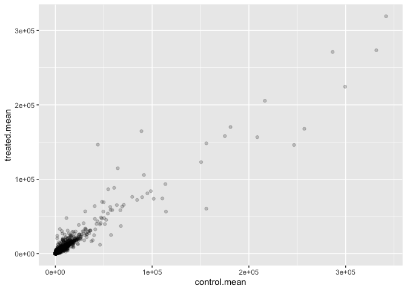
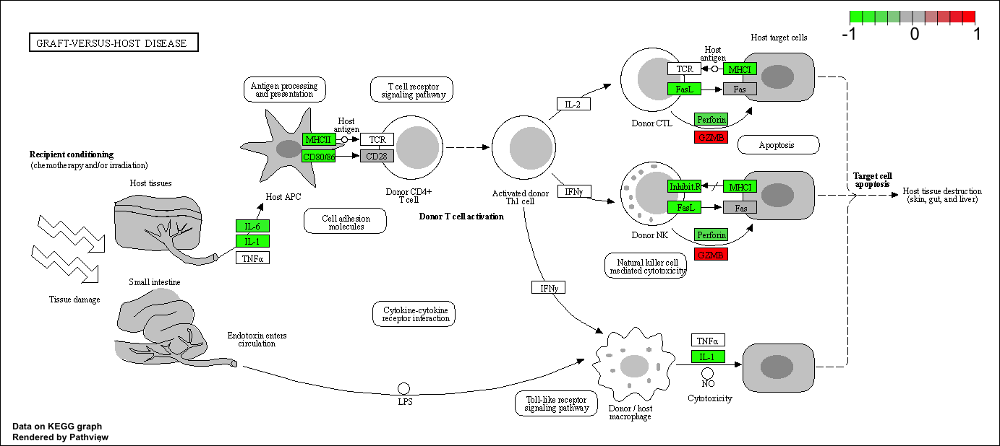

# Class13: RNAseq analysis with DESeq2
Brian Wells (PID: A69026838)

The data for this hands-on session comes from a published RNA-seq
experiment where airway smooth muscle cells were treated with
dexamethasone (“dex”), a synthetic glucocorticoid steroid with
anti-inflammatory effects (Himes et al. 2014).

``` r
library(DESeq2)
```

## 

``` r
# Complete the missing code
counts <- read.csv("airway_scaledcounts.csv", row.names=1)
metadata <-  read.csv("airway_metadata.csv")
```

``` r
head(counts)
```

                    SRR1039508 SRR1039509 SRR1039512 SRR1039513 SRR1039516
    ENSG00000000003        723        486        904        445       1170
    ENSG00000000005          0          0          0          0          0
    ENSG00000000419        467        523        616        371        582
    ENSG00000000457        347        258        364        237        318
    ENSG00000000460         96         81         73         66        118
    ENSG00000000938          0          0          1          0          2
                    SRR1039517 SRR1039520 SRR1039521
    ENSG00000000003       1097        806        604
    ENSG00000000005          0          0          0
    ENSG00000000419        781        417        509
    ENSG00000000457        447        330        324
    ENSG00000000460         94        102         74
    ENSG00000000938          0          0          0

> Q1. How many genes are in this dataset?

``` r
nrow(counts)
```

    [1] 38694

> Q2. How many ‘control’ cell lines do we have?

``` r
sum(metadata$dex == "control")
```

    [1] 4

I want to compare the control tot he treated columns. To do this I will:

- Step 1: Identify and extract the “control” columns
- Step 2: Calculate the mean value per gene for all these “control”
  columns and save as `control.mean`
- Step 3: Do the same for the treated (save as `treated.mean`)
- Step 4: Compare the `control.mean` and `treated.mean` claues

``` r
control.inds <- metadata$dex == "control"
```

``` r
control.mean <- rowMeans(counts[,control.inds])
head(control.mean)
```

    ENSG00000000003 ENSG00000000005 ENSG00000000419 ENSG00000000457 ENSG00000000460 
             900.75            0.00          520.50          339.75           97.25 
    ENSG00000000938 
               0.75 

> Q3. How would you make the above code in either approach more robust?
> Is there a function that could help here?

The example code isn’t great because its hardcoding the “4”. Using what
we used `rowMeans` avoids this problem

> Q4. Follow the same procedure for the treated samples (i.e. calculate
> the mean per gene across drug treated samples and assign to a labeled
> vector called treated.mean)

``` r
treated.inds <- metadata$dex == "treated"
```

``` r
treated.mean <- rowMeans(counts[,treated.inds])
head(treated.mean)
```

    ENSG00000000003 ENSG00000000005 ENSG00000000419 ENSG00000000457 ENSG00000000460 
             658.00            0.00          546.00          316.50           78.75 
    ENSG00000000938 
               0.00 

Lets combine them into a dataframe

``` r
meancounts <- data.frame(control.mean, treated.mean)
```

> Q5 (a). Create a scatter plot showing the mean of the treated samples
> against the mean of the control samples. Your plot should look
> something like the following.

lets see what these count values look like.

``` r
plot(meancounts)
```


> Q5 (b).You could also use the ggplot2 package to make this figure
> producing the plot below. What geom\_?() function would you use for
> this plot?

point

``` r
library(ggplot2)

ggplot(meancounts)+
  aes(control.mean, treated.mean) + 
  geom_point(alpha=0.2)
```



> Q6. Try plotting both axes on a log scale. What is the argument to
> plot() that allows you to do this?

``` r
plot(meancounts, log="xy")
```

    Warning in xy.coords(x, y, xlabel, ylabel, log): 15032 x values <= 0 omitted
    from logarithmic plot

    Warning in xy.coords(x, y, xlabel, ylabel, log): 15281 y values <= 0 omitted
    from logarithmic plot


> Q7. What is the purpose of the arr.ind argument in the which()
> function call above? Why would we then take the first column of the
> output and need to call the unique() function?

arr.ind =T causes the which() function to return both row and column
indices where there are TRUE values. This will tell us which of the rows
or columns have zero counts (rows are all we care about here). The
unique() function makes sure that we dont double count any rows.

logs are super useful when we have such skewed data.

``` r
#treated / control
log2(10/10)
```

    [1] 0

``` r
log2(20/10)
```

    [1] 1

Add log2(Fold-change) values to our wee results table.

``` r
meancounts$log2fc <- log2(meancounts$treated.mean / meancounts$control.mean)
head(meancounts)
```

                    control.mean treated.mean      log2fc
    ENSG00000000003       900.75       658.00 -0.45303916
    ENSG00000000005         0.00         0.00         NaN
    ENSG00000000419       520.50       546.00  0.06900279
    ENSG00000000457       339.75       316.50 -0.10226805
    ENSG00000000460        97.25        78.75 -0.30441833
    ENSG00000000938         0.75         0.00        -Inf

Need to exclude any genes with zero counts as we can’t say anything
about them anyway from this experiment and it cuases me math pain.

``` r
#What values in the first two cols are zero
to.rm.inds <- rowSums(meancounts[,1:2] == 0) > 0
mycounts <- meancounts[!to.rm.inds,]
```

> Q. how many genes do I have left?

``` r
nrow(mycounts)
```

    [1] 21817

> Q7. How many genes are “up regulated” (ie have a log2(fc) greater that
> +2)?

``` r
sum(mycounts$log2fc > +2)
```

    [1] 250

> Q8. How many are “down with a log2(fc) less than -2?

``` r
sum(mycounts$log2fc < -2)
```

    [1] 367

> Q9. Do you trust these results? Why or why not?

No. We have not factored in p-value or padj so, while the fold change
may be high, the results may not be significant. This could mean that
many of the results from the previous 2 questions aren’t actually
noteworthy and are misleading.

\##Running DESeq

Like many bioconductor analysis packages, DESeq wants it’s input in a
very particular way

``` r
dds <- DESeqDataSetFromMatrix(countData = counts,
                       colData = metadata,
                       design=~dex)
```

    converting counts to integer mode

    Warning in DESeqDataSet(se, design = design, ignoreRank): some variables in
    design formula are characters, converting to factors

To run DESeq analysis we call the main function from the package called
`DESeq(dds)`

``` r
dds <- DESeq(dds)
```

    estimating size factors

    estimating dispersions

    gene-wise dispersion estimates

    mean-dispersion relationship

    final dispersion estimates

    fitting model and testing

To get the results out of `dds` object we can use the DESeq `results()`
function.

``` r
res <- results(dds)
head(res)
```

    log2 fold change (MLE): dex treated vs control 
    Wald test p-value: dex treated vs control 
    DataFrame with 6 rows and 6 columns
                      baseMean log2FoldChange     lfcSE      stat    pvalue
                     <numeric>      <numeric> <numeric> <numeric> <numeric>
    ENSG00000000003 747.194195     -0.3507030  0.168246 -2.084470 0.0371175
    ENSG00000000005   0.000000             NA        NA        NA        NA
    ENSG00000000419 520.134160      0.2061078  0.101059  2.039475 0.0414026
    ENSG00000000457 322.664844      0.0245269  0.145145  0.168982 0.8658106
    ENSG00000000460  87.682625     -0.1471420  0.257007 -0.572521 0.5669691
    ENSG00000000938   0.319167     -1.7322890  3.493601 -0.495846 0.6200029
                         padj
                    <numeric>
    ENSG00000000003  0.163035
    ENSG00000000005        NA
    ENSG00000000419  0.176032
    ENSG00000000457  0.961694
    ENSG00000000460  0.815849
    ENSG00000000938        NA

A common summary visualization is called a volcano plot

``` r
plot(res$log2FoldChange, -log10(res$padj),
     xlab="log2 Fold-Change",
     ylab= "-log10 P-vlaues")
abline(v=c(-2,2), col="red")
abline(h=-log(0.05), col="blue")
```


``` r
mycols <- rep("grey", nrow(res))
mycols[res$log2FoldChange > 2] <- "black"
mycols[res$log2FoldChange < -2] <- "black"
mycols[res$padj>0.05] <- "grey"
```

``` r
plot(res$log2FoldChange, -log10(res$padj), col=mycols,
     xlab="log2 Fold-Change",
     ylab= "-log10 P-vlaues")
abline(v=c(-2,2), col="red")
abline(h=-log(0.05), col="blue")
```


# save our results

``` r
write.csv(res, file="myresults.csv")
```

\#Adding annotation data

We need to translate or “map” our ensemble IDs into more understandable
gene names and the identifiers that other useful databases use.

``` r
library(AnnotationDbi)
library("org.Hs.eg.db")
```

``` r
columns(org.Hs.eg.db)
```

     [1] "ACCNUM"       "ALIAS"        "ENSEMBL"      "ENSEMBLPROT"  "ENSEMBLTRANS"
     [6] "ENTREZID"     "ENZYME"       "EVIDENCE"     "EVIDENCEALL"  "GENENAME"    
    [11] "GENETYPE"     "GO"           "GOALL"        "IPI"          "MAP"         
    [16] "OMIM"         "ONTOLOGY"     "ONTOLOGYALL"  "PATH"         "PFAM"        
    [21] "PMID"         "PROSITE"      "REFSEQ"       "SYMBOL"       "UCSCKG"      
    [26] "UNIPROT"     

``` r
res$symbol <- mapIds(org.Hs.eg.db,
                     keys=row.names(res), # Our genenames
                     keytype="ENSEMBL",        # The format of our genenames
                     column="SYMBOL",          # The new format we want to add
                     multiVals="first")
```

    'select()' returned 1:many mapping between keys and columns

``` r
head(res)
```

    log2 fold change (MLE): dex treated vs control 
    Wald test p-value: dex treated vs control 
    DataFrame with 6 rows and 7 columns
                      baseMean log2FoldChange     lfcSE      stat    pvalue
                     <numeric>      <numeric> <numeric> <numeric> <numeric>
    ENSG00000000003 747.194195     -0.3507030  0.168246 -2.084470 0.0371175
    ENSG00000000005   0.000000             NA        NA        NA        NA
    ENSG00000000419 520.134160      0.2061078  0.101059  2.039475 0.0414026
    ENSG00000000457 322.664844      0.0245269  0.145145  0.168982 0.8658106
    ENSG00000000460  87.682625     -0.1471420  0.257007 -0.572521 0.5669691
    ENSG00000000938   0.319167     -1.7322890  3.493601 -0.495846 0.6200029
                         padj      symbol
                    <numeric> <character>
    ENSG00000000003  0.163035      TSPAN6
    ENSG00000000005        NA        TNMD
    ENSG00000000419  0.176032        DPM1
    ENSG00000000457  0.961694       SCYL3
    ENSG00000000460  0.815849       FIRRM
    ENSG00000000938        NA         FGR

> Q11. Run the mapIds() function two more times to add the Entrez ID and
> UniProt accession and GENENAME as new columns called
> res$entrez, res$uniprot and res\$genename.

``` r
res$entrez <- mapIds(org.Hs.eg.db,
                     keys=row.names(res),
                     column="ENTREZID",
                     keytype="ENSEMBL",
                     multiVals="first")
```

    'select()' returned 1:many mapping between keys and columns

``` r
res$uniprot <- mapIds(org.Hs.eg.db,
                     keys=row.names(res),
                     column="UNIPROT",
                     keytype="ENSEMBL",
                     multiVals="first")
```

    'select()' returned 1:many mapping between keys and columns

``` r
res$genename <- mapIds(org.Hs.eg.db,
                     keys=row.names(res),
                     column="GENENAME",
                     keytype="ENSEMBL",
                     multiVals="first")
```

    'select()' returned 1:many mapping between keys and columns

``` r
head(res)
```

    log2 fold change (MLE): dex treated vs control 
    Wald test p-value: dex treated vs control 
    DataFrame with 6 rows and 10 columns
                      baseMean log2FoldChange     lfcSE      stat    pvalue
                     <numeric>      <numeric> <numeric> <numeric> <numeric>
    ENSG00000000003 747.194195     -0.3507030  0.168246 -2.084470 0.0371175
    ENSG00000000005   0.000000             NA        NA        NA        NA
    ENSG00000000419 520.134160      0.2061078  0.101059  2.039475 0.0414026
    ENSG00000000457 322.664844      0.0245269  0.145145  0.168982 0.8658106
    ENSG00000000460  87.682625     -0.1471420  0.257007 -0.572521 0.5669691
    ENSG00000000938   0.319167     -1.7322890  3.493601 -0.495846 0.6200029
                         padj      symbol      entrez     uniprot
                    <numeric> <character> <character> <character>
    ENSG00000000003  0.163035      TSPAN6        7105  A0A024RCI0
    ENSG00000000005        NA        TNMD       64102      Q9H2S6
    ENSG00000000419  0.176032        DPM1        8813      O60762
    ENSG00000000457  0.961694       SCYL3       57147      Q8IZE3
    ENSG00000000460  0.815849       FIRRM       55732  A0A024R922
    ENSG00000000938        NA         FGR        2268      P09769
                                  genename
                               <character>
    ENSG00000000003          tetraspanin 6
    ENSG00000000005            tenomodulin
    ENSG00000000419 dolichyl-phosphate m..
    ENSG00000000457 SCY1 like pseudokina..
    ENSG00000000460 FIGNL1 interacting r..
    ENSG00000000938 FGR proto-oncogene, ..

``` r
ord <- order( res$padj )
#View(res[ord,])
head(res[ord,])
```

    log2 fold change (MLE): dex treated vs control 
    Wald test p-value: dex treated vs control 
    DataFrame with 6 rows and 10 columns
                     baseMean log2FoldChange     lfcSE      stat      pvalue
                    <numeric>      <numeric> <numeric> <numeric>   <numeric>
    ENSG00000152583   954.771        4.36836 0.2371268   18.4220 8.74490e-76
    ENSG00000179094   743.253        2.86389 0.1755693   16.3120 8.10784e-60
    ENSG00000116584  2277.913       -1.03470 0.0650984  -15.8944 6.92855e-57
    ENSG00000189221  2383.754        3.34154 0.2124058   15.7319 9.14433e-56
    ENSG00000120129  3440.704        2.96521 0.2036951   14.5571 5.26424e-48
    ENSG00000148175 13493.920        1.42717 0.1003890   14.2164 7.25128e-46
                           padj      symbol      entrez     uniprot
                      <numeric> <character> <character> <character>
    ENSG00000152583 1.32441e-71     SPARCL1        8404  A0A024RDE1
    ENSG00000179094 6.13966e-56        PER1        5187      O15534
    ENSG00000116584 3.49776e-53     ARHGEF2        9181      Q92974
    ENSG00000189221 3.46227e-52        MAOA        4128      P21397
    ENSG00000120129 1.59454e-44       DUSP1        1843      B4DU40
    ENSG00000148175 1.83034e-42        STOM        2040      F8VSL7
                                  genename
                               <character>
    ENSG00000152583           SPARC like 1
    ENSG00000179094 period circadian reg..
    ENSG00000116584 Rho/Rac guanine nucl..
    ENSG00000189221    monoamine oxidase A
    ENSG00000120129 dual specificity pho..
    ENSG00000148175               stomatin

``` r
write.csv(res[ord,], "deseq_results.csv")
```

``` r
library(pathview)
```

    ##############################################################################
    Pathview is an open source software package distributed under GNU General
    Public License version 3 (GPLv3). Details of GPLv3 is available at
    http://www.gnu.org/licenses/gpl-3.0.html. Particullary, users are required to
    formally cite the original Pathview paper (not just mention it) in publications
    or products. For details, do citation("pathview") within R.

    The pathview downloads and uses KEGG data. Non-academic uses may require a KEGG
    license agreement (details at http://www.kegg.jp/kegg/legal.html).
    ##############################################################################

``` r
library(gage)
```

``` r
library(gageData)

data(kegg.sets.hs)

# Examine the first 2 pathways in this kegg set for humans
head(kegg.sets.hs, 2)
```

    $`hsa00232 Caffeine metabolism`
    [1] "10"   "1544" "1548" "1549" "1553" "7498" "9"   

    $`hsa00983 Drug metabolism - other enzymes`
     [1] "10"     "1066"   "10720"  "10941"  "151531" "1548"   "1549"   "1551"  
     [9] "1553"   "1576"   "1577"   "1806"   "1807"   "1890"   "221223" "2990"  
    [17] "3251"   "3614"   "3615"   "3704"   "51733"  "54490"  "54575"  "54576" 
    [25] "54577"  "54578"  "54579"  "54600"  "54657"  "54658"  "54659"  "54963" 
    [33] "574537" "64816"  "7083"   "7084"   "7172"   "7363"   "7364"   "7365"  
    [41] "7366"   "7367"   "7371"   "7372"   "7378"   "7498"   "79799"  "83549" 
    [49] "8824"   "8833"   "9"      "978"   

``` r
foldchanges = res$log2FoldChange
names(foldchanges) = res$entrez
head(foldchanges)
```

           7105       64102        8813       57147       55732        2268 
    -0.35070302          NA  0.20610777  0.02452695 -0.14714205 -1.73228897 

``` r
# Get the results
keggres = gage(foldchanges, gsets=kegg.sets.hs)
```

``` r
attributes(keggres)
```

    $names
    [1] "greater" "less"    "stats"  

``` r
head(keggres$less, 3)
```

                                          p.geomean stat.mean        p.val
    hsa05332 Graft-versus-host disease 0.0004250461 -3.473346 0.0004250461
    hsa04940 Type I diabetes mellitus  0.0017820293 -3.002352 0.0017820293
    hsa05310 Asthma                    0.0020045888 -3.009050 0.0020045888
                                            q.val set.size         exp1
    hsa05332 Graft-versus-host disease 0.09053483       40 0.0004250461
    hsa04940 Type I diabetes mellitus  0.14232581       42 0.0017820293
    hsa05310 Asthma                    0.14232581       29 0.0020045888

``` r
pathview(gene.data=foldchanges, pathway.id="hsa05310")
```

    'select()' returned 1:1 mapping between keys and columns

    Info: Working in directory /Users/brianwells/bggn213/bggn213_github/Class13

    Info: Writing image file hsa05310.pathview.png

 \>Q12. Can you do the same procedure as above
to plot the pathview figures for the top 2 down-reguled pathways?

Yes.

``` r
pathview(gene.data=foldchanges, pathway.id="hsa04940")
```

    'select()' returned 1:1 mapping between keys and columns

    Info: Working in directory /Users/brianwells/bggn213/bggn213_github/Class13

    Info: Writing image file hsa04940.pathview.png


``` r
pathview(gene.data=foldchanges, pathway.id="hsa05332")
```

    'select()' returned 1:1 mapping between keys and columns

    Info: Working in directory /Users/brianwells/bggn213/bggn213_github/Class13

    Info: Writing image file hsa05332.pathview.png


