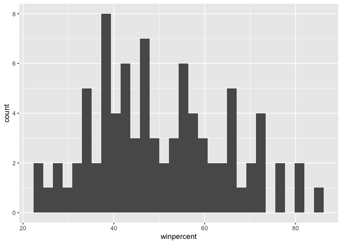
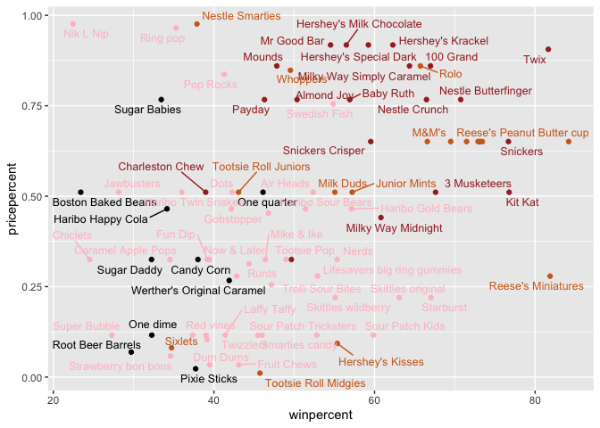
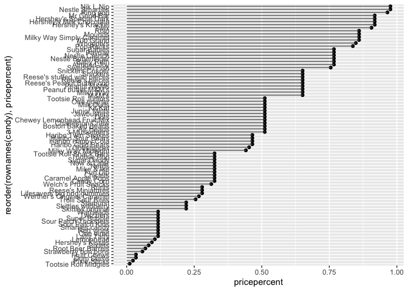
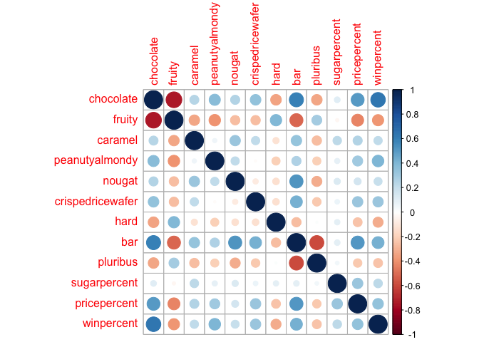
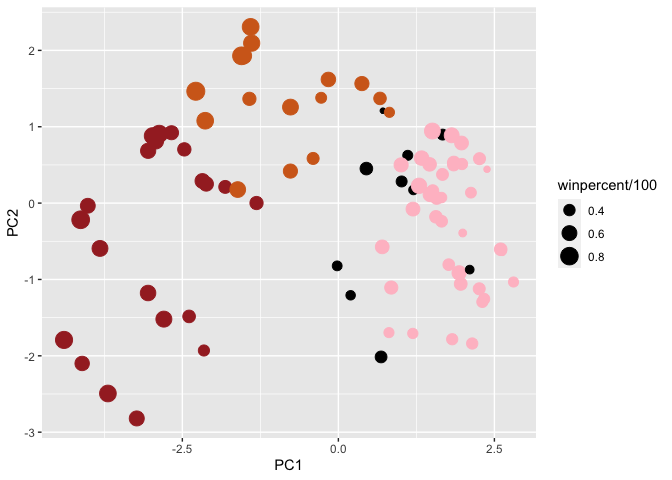
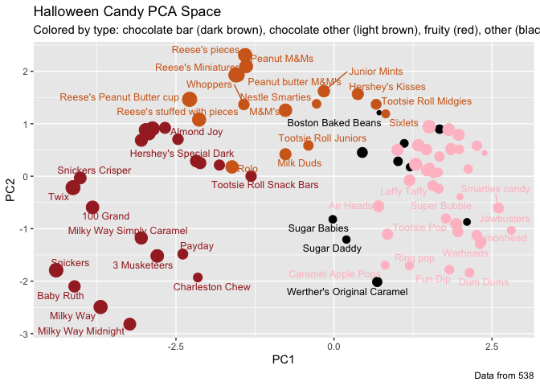

# class 08: mini project
Brian Wells (PID: A69026838)

``` r
candy_file <- "candy-data.csv"

candy = read.csv(candy_file, row.names=1)
head(candy)
```

                 chocolate fruity caramel peanutyalmondy nougat crispedricewafer
    100 Grand            1      0       1              0      0                1
    3 Musketeers         1      0       0              0      1                0
    One dime             0      0       0              0      0                0
    One quarter          0      0       0              0      0                0
    Air Heads            0      1       0              0      0                0
    Almond Joy           1      0       0              1      0                0
                 hard bar pluribus sugarpercent pricepercent winpercent
    100 Grand       0   1        0        0.732        0.860   66.97173
    3 Musketeers    0   1        0        0.604        0.511   67.60294
    One dime        0   0        0        0.011        0.116   32.26109
    One quarter     0   0        0        0.011        0.511   46.11650
    Air Heads       0   0        0        0.906        0.511   52.34146
    Almond Joy      0   1        0        0.465        0.767   50.34755

> Q1: How many different candy types are in this dataset?

The number of rows is the number of candies.

``` r
nrow(candy)
```

    [1] 85

> Q2: How many fruity candy types are in the dataset?

``` r
sum(candy$fruity)
```

    [1] 38

> Q3: What is your favorite candy in the dataset and what is it’s
> winpercent value?

``` r
candy["Caramel Apple Pop", ]$winpercent
```

    [1] 34.51768

> Q4:What is the winpercent value for “Kit Kat”?

``` r
candy["Kit Kat", ]$winpercent
```

    [1] 76.7686

> Q5: What is the winpercent value for “Tootsie Roll Snack Bars”?

``` r
candy["Tootsie Roll Snack Bars", ]$winpercent
```

    [1] 49.6535

``` r
##install.packages("skimr")
```

``` r
library("skimr")
skim(candy)
```

|                                                  |       |
|:-------------------------------------------------|:------|
| Name                                             | candy |
| Number of rows                                   | 85    |
| Number of columns                                | 12    |
| \_\_\_\_\_\_\_\_\_\_\_\_\_\_\_\_\_\_\_\_\_\_\_   |       |
| Column type frequency:                           |       |
| numeric                                          | 12    |
| \_\_\_\_\_\_\_\_\_\_\_\_\_\_\_\_\_\_\_\_\_\_\_\_ |       |
| Group variables                                  | None  |

Data summary

**Variable type: numeric**

| skim_variable    | n_missing | complete_rate |  mean |    sd |    p0 |   p25 |   p50 |   p75 |  p100 | hist  |
|:-----------------|----------:|--------------:|------:|------:|------:|------:|------:|------:|------:|:------|
| chocolate        |         0 |             1 |  0.44 |  0.50 |  0.00 |  0.00 |  0.00 |  1.00 |  1.00 | ▇▁▁▁▆ |
| fruity           |         0 |             1 |  0.45 |  0.50 |  0.00 |  0.00 |  0.00 |  1.00 |  1.00 | ▇▁▁▁▆ |
| caramel          |         0 |             1 |  0.16 |  0.37 |  0.00 |  0.00 |  0.00 |  0.00 |  1.00 | ▇▁▁▁▂ |
| peanutyalmondy   |         0 |             1 |  0.16 |  0.37 |  0.00 |  0.00 |  0.00 |  0.00 |  1.00 | ▇▁▁▁▂ |
| nougat           |         0 |             1 |  0.08 |  0.28 |  0.00 |  0.00 |  0.00 |  0.00 |  1.00 | ▇▁▁▁▁ |
| crispedricewafer |         0 |             1 |  0.08 |  0.28 |  0.00 |  0.00 |  0.00 |  0.00 |  1.00 | ▇▁▁▁▁ |
| hard             |         0 |             1 |  0.18 |  0.38 |  0.00 |  0.00 |  0.00 |  0.00 |  1.00 | ▇▁▁▁▂ |
| bar              |         0 |             1 |  0.25 |  0.43 |  0.00 |  0.00 |  0.00 |  0.00 |  1.00 | ▇▁▁▁▂ |
| pluribus         |         0 |             1 |  0.52 |  0.50 |  0.00 |  0.00 |  1.00 |  1.00 |  1.00 | ▇▁▁▁▇ |
| sugarpercent     |         0 |             1 |  0.48 |  0.28 |  0.01 |  0.22 |  0.47 |  0.73 |  0.99 | ▇▇▇▇▆ |
| pricepercent     |         0 |             1 |  0.47 |  0.29 |  0.01 |  0.26 |  0.47 |  0.65 |  0.98 | ▇▇▇▇▆ |
| winpercent       |         0 |             1 | 50.32 | 14.71 | 22.45 | 39.14 | 47.83 | 59.86 | 84.18 | ▃▇▆▅▂ |

> Q6. Is there any variable/column that looks to be on a different scale
> to the majority of the other columns in the dataset?

The variable on a difference scale seems to be “win percent”.

> Q7. What do you think a zero and one represent for the
> candy\$chocolate column?

0 probably means that the candy does not have chocolate, 1 means it
does.

> Q8. Plot a histogram of winpercent values.

``` r
library(ggplot2)
ggplot(candy, aes(winpercent)) +
geom_histogram()
```

    `stat_bin()` using `bins = 30`. Pick better value with `binwidth`.



> Q9: Is the distribution of winpercent values symmetrical?

no, the distribution is not symmetrical

> Q10: Is the center of the distribution above or below 50%?

It is below 50%

> Q11: On average is chocolate candy higher or lower ranked than fruit
> candy?

``` r
mean(candy$winpercent[as.logical(candy$chocolate)])
```

    [1] 60.92153

``` r
mean(candy$winpercent[as.logical(candy$fruity)])
```

    [1] 44.11974

on average, chocolate is ranked higher.

> Q12: Is this difference statistically significant?

``` r
choc <- (candy$winpercent[as.logical(candy$chocolate)])
fruit <- (candy$winpercent[as.logical(candy$fruity)])
t.test(choc,fruit)
```


        Welch Two Sample t-test

    data:  choc and fruit
    t = 6.2582, df = 68.882, p-value = 2.871e-08
    alternative hypothesis: true difference in means is not equal to 0
    95 percent confidence interval:
     11.44563 22.15795
    sample estimates:
    mean of x mean of y 
     60.92153  44.11974 

The difference is statistically significant.

> Q13. What are the five least liked candy types in this set?

``` r
library(dplyr)
```


    Attaching package: 'dplyr'

    The following objects are masked from 'package:stats':

        filter, lag

    The following objects are masked from 'package:base':

        intersect, setdiff, setequal, union

``` r
candy %>% 
  arrange(winpercent) %>%
  head(5)
```

                       chocolate fruity caramel peanutyalmondy nougat
    Nik L Nip                  0      1       0              0      0
    Boston Baked Beans         0      0       0              1      0
    Chiclets                   0      1       0              0      0
    Super Bubble               0      1       0              0      0
    Jawbusters                 0      1       0              0      0
                       crispedricewafer hard bar pluribus sugarpercent pricepercent
    Nik L Nip                         0    0   0        1        0.197        0.976
    Boston Baked Beans                0    0   0        1        0.313        0.511
    Chiclets                          0    0   0        1        0.046        0.325
    Super Bubble                      0    0   0        0        0.162        0.116
    Jawbusters                        0    1   0        1        0.093        0.511
                       winpercent
    Nik L Nip            22.44534
    Boston Baked Beans   23.41782
    Chiclets             24.52499
    Super Bubble         27.30386
    Jawbusters           28.12744

Nik L Nip, Boston Baked Beans, Chiclets, Super Bubble, Jawbusters

> Q14. What are the top 5 all time favorite candy types out of this set?

``` r
candy %>% 
  arrange(winpercent) %>%
  tail(5)
```

                              chocolate fruity caramel peanutyalmondy nougat
    Snickers                          1      0       1              1      1
    Kit Kat                           1      0       0              0      0
    Twix                              1      0       1              0      0
    Reese's Miniatures                1      0       0              1      0
    Reese's Peanut Butter cup         1      0       0              1      0
                              crispedricewafer hard bar pluribus sugarpercent
    Snickers                                 0    0   1        0        0.546
    Kit Kat                                  1    0   1        0        0.313
    Twix                                     1    0   1        0        0.546
    Reese's Miniatures                       0    0   0        0        0.034
    Reese's Peanut Butter cup                0    0   0        0        0.720
                              pricepercent winpercent
    Snickers                         0.651   76.67378
    Kit Kat                          0.511   76.76860
    Twix                             0.906   81.64291
    Reese's Miniatures               0.279   81.86626
    Reese's Peanut Butter cup        0.651   84.18029

Snickers, Kit Kat, Twix, Reese’s miniatures, Reese’s Peanut Butter Cup

> Q15. Make a first barplot of candy ranking based on winpercent values.

``` r
library(ggplot2)

ggplot(candy) + 
  aes(winpercent, rownames(candy)) +
  geom_col()
```


> Q16. This is quite ugly, use the reorder() function to get the bars
> sorted by winpercent?

``` r
library(ggplot2)

ggplot(candy) + 
  aes(winpercent, reorder(rownames(candy),winpercent)) +
  geom_col()
```


``` r
my_cols=rep("black", nrow(candy))
my_cols[as.logical(candy$chocolate)] = "chocolate"
my_cols[as.logical(candy$bar)] = "brown"
my_cols[as.logical(candy$fruity)] = "pink"

ggplot(candy) + 
  aes(winpercent, reorder(rownames(candy),winpercent)) +
  geom_col(fill=my_cols) 
```


> Q17. What is the worst ranked chocolate candy?

Sixlets

> Q18. What is the best ranked fruity candy?

Starburst

``` r
#install.packages("ggrepel")
library(ggrepel)

# How about a plot of price vs win
ggplot(candy) +
  aes(winpercent, pricepercent, label=rownames(candy)) +
  geom_point(col=my_cols) + 
  geom_text_repel(col=my_cols, size=3.3, max.overlaps = 10)
```

    Warning: ggrepel: 10 unlabeled data points (too many overlaps). Consider
    increasing max.overlaps



> Q19. Which candy type is the highest ranked in terms of winpercent for
> the least money - i.e. offers the most bang for your buck?

``` r
ord <- order(candy$pricepercent, decreasing = T)
tail( candy[ord,c(11,12)], n=5 )
```

                         pricepercent winpercent
    Strawberry bon bons         0.058   34.57899
    Dum Dums                    0.034   39.46056
    Fruit Chews                 0.034   43.08892
    Pixie Sticks                0.023   37.72234
    Tootsie Roll Midgies        0.011   45.73675

Tootsie Roll Midgies

> Q20. What are the top 5 most expensive candy types in the dataset and
> of these which is the least popular?

``` r
ord <- order(candy$pricepercent, decreasing = TRUE)
head( candy[ord,c(11,12)], n=5 )
```

                             pricepercent winpercent
    Nik L Nip                       0.976   22.44534
    Nestle Smarties                 0.976   37.88719
    Ring pop                        0.965   35.29076
    Hershey's Krackel               0.918   62.28448
    Hershey's Milk Chocolate        0.918   56.49050

Nik L nip is the least popular.

> Q21. Make a barplot again with geom_col() this time using pricepercent
> and then improve this step by step, first ordering the x-axis by value
> and finally making a so called “dot chat” or “lollipop” chart by
> swapping geom_col() for geom_point() + geom_segment().

``` r
library(ggplot2)

ggplot(candy) + 
  aes(pricepercent, reorder(rownames(candy),pricepercent)) +
  geom_col()
```


``` r
library(ggplot2)

ggplot(candy) + 
  aes(pricepercent, reorder(rownames(candy),pricepercent)) +
  geom_point() + 
  geom_segment(aes(yend = reorder(rownames(candy), pricepercent), 
                   xend = 0), col="gray40") 
```



``` r
#install.packages("corrplot")
library(corrplot)
```

    corrplot 0.92 loaded

``` r
cij <- cor(candy)
corrplot(cij)
```



> Q22. Examining this plot what two variables are anti-correlated
> (i.e. have minus values)?

chocolate and fruity.

> Q23. Similarly, what two variables are most positively correlated?

chocolate and winpercent

``` r
pca <- prcomp(candy, scale=T)
summary(pca)
```

    Importance of components:
                              PC1    PC2    PC3     PC4    PC5     PC6     PC7
    Standard deviation     2.0788 1.1378 1.1092 1.07533 0.9518 0.81923 0.81530
    Proportion of Variance 0.3601 0.1079 0.1025 0.09636 0.0755 0.05593 0.05539
    Cumulative Proportion  0.3601 0.4680 0.5705 0.66688 0.7424 0.79830 0.85369
                               PC8     PC9    PC10    PC11    PC12
    Standard deviation     0.74530 0.67824 0.62349 0.43974 0.39760
    Proportion of Variance 0.04629 0.03833 0.03239 0.01611 0.01317
    Cumulative Proportion  0.89998 0.93832 0.97071 0.98683 1.00000

``` r
plot(pca$x[,1:2])
```


``` r
plot(pca$x[,1:2], col=my_cols, pch=16)
```


``` r
# Make a new data-frame with our PCA results and candy data
my_data <- cbind(candy, pca$x[,1:3])
```

``` r
p <- ggplot(my_data) + 
        aes(x=PC1, y=PC2, 
            size=winpercent/100,  
            text=rownames(my_data),
            label=rownames(my_data)) +
        geom_point(col=my_cols)

p
```



``` r
library(ggrepel)

p + geom_text_repel(size=3.3, col=my_cols, max.overlaps = 7)  + 
  theme(legend.position = "none") +
  labs(title="Halloween Candy PCA Space",
       subtitle="Colored by type: chocolate bar (dark brown), chocolate other (light brown), fruity (red), other (black)",
       caption="Data from 538")
```

    Warning: ggrepel: 39 unlabeled data points (too many overlaps). Consider
    increasing max.overlaps



``` r
#install.packages("plotly")
library(plotly)
```


    Attaching package: 'plotly'

    The following object is masked from 'package:ggplot2':

        last_plot

    The following object is masked from 'package:stats':

        filter

    The following object is masked from 'package:graphics':

        layout

``` r
#ggplotly(p)
```

``` r
par(mar=c(8,4,2,2))
barplot(pca$rotation[,1], las=2, ylab="PC1 Contribution")
```


> Q24. What original variables are picked up strongly by PC1 in the
> positive direction? Do these make sense to you?

Fruity, hard, and pluribus. This makes sense because fruity candy is
almost always pluribus and hard. The other qualities (caramel, nuts,
nougat, wafer) are often associated with chocolate candy.
