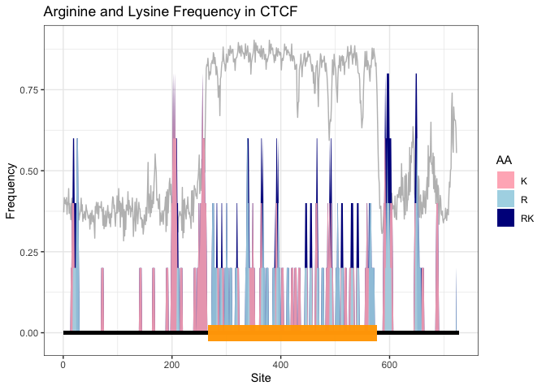
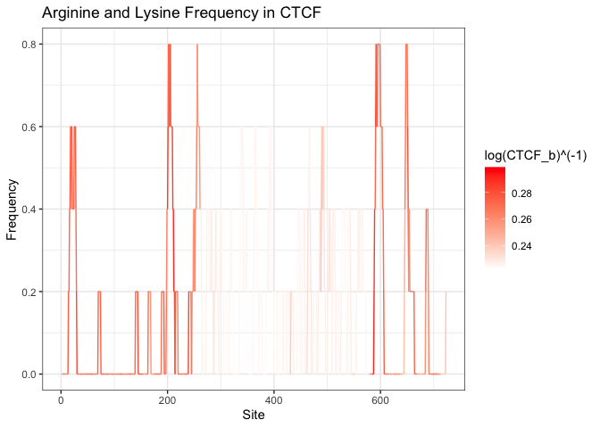

# Steven_class
Brian Wells

\#load the CTCF protein sequence

``` r
CTCF <- "MEGDAVEAIVEESETFIKGKERKTYQRRREGGQEEDACHLPQNQTDGGEVVQDVNSSVQMVMMEQLDPTLLQMKTEVMEGTVAPEAEAAVDDTQIITLQVVNMEEQPINIGELQLVQVPVPVTVPVATTSVEELQGAYENEVSKEGLAESEPMICHTLPLPEGFQVVKVGANGEVETLEQGELPPQEDPSWQKDPDYQPPAKKTKKTKKSKLRYTEEGKDVDVSVYDFEEEQQEGLLSEVNAEKVVGNMKPPKPTKIKKKGVKKTFQCELCSYTCPRRSNLDRHMKSHTDERPHKCHLCGRAFRTVTLLRNHLNTHTGTRPHKCPDCDMAFVTSGELVRHRRYKHTHEKPFKCSMCDYASVEVSKLKRHIRSHTGERPFQCSLCSYASRDTYKLKRHMRTHSGEKPYECYICHARFTQSGTMKMHILQKHTENVAKFHCPHCDTVIARKSDLGVHLRKQHSYIEQGKKCRYCDAVFHERYALIQHQKSHKNEKRFKCDQCDYACRQERHMIMHKRTHTGEKPYACSHCDKTFRQKQLLDMHFKRYHDPNFVPAAFVCSKCGKTFTRRNTMARHADNCAGPDGVEGENGGETKKSKRGRKRKMRSKKEDSSDSENAEPDLDDNEDEEEPAVEIEPEPEPQPVTPAPPPAKKRRGRPPGRTNQPKQNQPTAIIQVEDQNTGAIENIIVEVKKEPDAEPAEGEEEEAQPAATDAPNGDLTPEMILSMMDR"
```

I want to calculate the frequency of arginine and lysine in the CTCF
sequence by creating a function in R. The function will take in a
sequence and return the frequency of arginine and lysine.

Convert the sequence to uppercase Set the chunk size to 5 AA Scan the
whole sequence by moving the chunk by 1 AA and calculate the frequency
of arginine and lysine for each chunk. Store the frequency in a
dataframe with columns: site, R_freq, K_freq, RK_freq.

``` r
count_RK_freq <- function(sequence) {
  # Convert the sequence to uppercase
  sequence <- toupper(sequence)

  # Set the chunk size
  chunk_size <- 5

  # Initialize a dataframe to store the results
  results <- data.frame(site = integer(), R_freq = numeric(), K_freq = numeric(), RK_freq = numeric())

  # Scan the sequence
  for (i in 1:(nchar(sequence) - chunk_size + 1)) {
    chunk <- substr(sequence, i, i + chunk_size - 1)
    
    # Calculate frequencies
    r_freq <- sum(strsplit(chunk, "")[[1]] == "R") / chunk_size
    k_freq <- sum(strsplit(chunk, "")[[1]] == "K") / chunk_size
    rk_freq <- r_freq + k_freq

    # Add to dataframe
    results <- rbind(results, data.frame(site = i, R_freq = r_freq, K_freq = k_freq, RK_freq = rk_freq))
  }

  return(results)
}
```

\#test the function

``` r
test_seq <- "mmmmmmmmmRRrKKKKnnnnnnnnRnnnnKnnn"

test_seq <- count_RK_freq(test_seq)
```

``` r
library(ggplot2)

ggplot(test_seq) + aes(x = site, y = RK_freq) + geom_line()
```


\#Calculate the arginine and lysine frequency for the CTCF sequence

``` r
CTCF_KR_freq <- count_RK_freq(CTCF)

# Plot KR_freq vs site by geom_area
ggplot(CTCF_KR_freq) + 
  aes(x = site, y = RK_freq) + 
  geom_area()
```


``` r
# Plot K_freq, R_freq, and KR_freq vs site by geom_area filled with different colors

ggplot(CTCF_KR_freq) + 
  geom_area(aes(x = site, y = RK_freq, fill = "RK"), alpha = 0.7) +
  geom_area(aes(x = site, y = K_freq, fill = "K"), alpha = 0.9) +
  geom_area(aes(x = site, y = R_freq, fill = "R"), alpha = 0.9) +
  # Add a legend
  scale_fill_manual(name = "AA", values = c("RK" = "black", "K" = "lightpink", "R" = "lightblue")) +
  # Add a title and labels
  labs(title = "Arginine and Lysine Frequency in CTCF", x = "Site", y = "Frequency")
```


``` r
library(bio3d)

CTCF_pdb <- read.pdb("AF-P49711-F1-model_v4.pdb")
```

``` r
library(dplyr)
```


    Attaching package: 'dplyr'

    The following objects are masked from 'package:stats':

        filter, lag

    The following objects are masked from 'package:base':

        intersect, setdiff, setequal, union

``` r
CTCF_b <- CTCF_pdb$atom %>% 
  filter(elety == "CA") %>% 
  select(b)
```

``` r
# CTCF_KR_freq <- cbind(CTCF_KR_freq, CTCF_b)
# This code does not work because the number of rows of CTCF_KR_freq and CTCF_b are different.

# We need to trimmed the first and last two elements of CTCF_b to reach the same length as CTCF_KR_freq

CTCF_b <- CTCF_b[3:(nrow(CTCF_b) - 2), ]

CTCF_KR_freq <- cbind(CTCF_KR_freq, CTCF_b)
```

``` r
p <- ggplot(CTCF_KR_freq) +
  geom_line(aes(x = site, y = CTCF_b / 100), color = "gray") +
  geom_area(aes(x = site, y = RK_freq, fill = "RK"), alpha = 1) +
  geom_area(aes(x = site, y = K_freq, fill = "K"), alpha = 0.9) +
  geom_area(aes(x = site, y = R_freq, fill = "R"), alpha = 0.9) +
  scale_fill_manual(name = "AA", values = c("RK" = "darkblue", "K" = "lightpink", "R" = "lightblue")) +
  labs(title = "Arginine and Lysine Frequency in CTCF", x = "Site", y = "Frequency") +
  theme_bw()

# Draw a line representing the protein sequence at the bottom of the plot
p <- p + geom_segment(aes(x = 1, xend = nchar(CTCF), y = 0, yend = 0), color = "black", size = 1.5)
```

    Warning: Using `size` aesthetic for lines was deprecated in ggplot2 3.4.0.
    ℹ Please use `linewidth` instead.

``` r
# Annotate the zinc finger regions of CTCF at sites: 266-577 by rectangles
p + geom_rect(aes(xmin = 266, xmax = 577, ymin = -0.025, ymax = 0.025), fill = "orange", alpha = 0.2)
```



``` r
## make a plot of KR_freq vs site with the B-factor as the color using area

ggplot(CTCF_KR_freq) +
  geom_line(aes(x = site, y = RK_freq, color = log(CTCF_b) ^ (-1))) +
  scale_color_gradient(low = "white", high = "red") +
  labs(title = "Arginine and Lysine Frequency in CTCF", x = "Site", y = "Frequency") +
  theme_bw()
```



``` r
library(readr)

CTCF_RIP <- read_tsv("ENCFF552MWL.tsv")
```

    Rows: 48453 Columns: 14
    ── Column specification ────────────────────────────────────────────────────────
    Delimiter: "\t"
    chr (8): test_id, gene_id, gene, locus, sample_1, sample_2, status, significant
    dbl (6): value_1, value_2, log2(fold_change), test_stat, p_value, q_value

    ℹ Use `spec()` to retrieve the full column specification for this data.
    ℹ Specify the column types or set `show_col_types = FALSE` to quiet this message.

``` r
head(CTCF_RIP)
```

    # A tibble: 6 × 14
      test_id           gene_id gene  locus sample_1 sample_2 status value_1 value_2
      <chr>             <chr>   <chr> <chr> <chr>    <chr>    <chr>    <dbl>   <dbl>
    1 ENSG00000000003.… ENSG00… TSPA… chrX… ctcf     input    NOTEST  0.0671  0.163 
    2 ENSG00000000005.5 ENSG00… TNMD  chrX… ctcf     input    NOTEST  0       0.0454
    3 ENSG00000000419.8 ENSG00… DPM1  chr2… ctcf     input    OK     63.7    42.7   
    4 ENSG00000000457.8 ENSG00… SCYL3 chr1… ctcf     input    OK      8.75    8.78  
    5 ENSG00000000460.… ENSG00… C1or… chr1… ctcf     input    OK     27.9    23.6   
    6 ENSG00000000938.8 ENSG00… FGR   chr1… ctcf     input    NOTEST  0.0905  0.0420
    # ℹ 5 more variables: `log2(fold_change)` <dbl>, test_stat <dbl>,
    #   p_value <dbl>, q_value <dbl>, significant <chr>

``` r
table(CTCF_RIP$significant)
```


       no   yes 
    46719  1734 

``` r
summary(CTCF_RIP$p_value)
```

       Min. 1st Qu.  Median    Mean 3rd Qu.    Max. 
    0.00005 0.49055 1.00000 0.74877 1.00000 1.00000 

``` r
summary(CTCF_RIP$q_value)
```

        Min.  1st Qu.   Median     Mean  3rd Qu.     Max. 
    0.001922 0.813944 1.000000 0.835909 1.000000 1.000000 

``` r
# Count how many genes are significant
sum(CTCF_RIP$significant == "yes")
```

    [1] 1734

``` r
# Count how many genes have a q-value < 0.05
sum(CTCF_RIP$q_value < 0.05)
```

    [1] 1734

``` r
# Trimmed out rows with NA or Inf `log2(fold_change)` values.

library(dplyr)

CTCF_RIP_trimmed <- CTCF_RIP %>% 
  filter(!is.na(`log2(fold_change)`) & 
           `log2(fold_change)` != Inf & 
           `log2(fold_change)` != -Inf &
           `log2(fold_change)` >= 0)

# Trimmed out rows with `q_value` values of 1.

CTCF_RIP_trimmed <- CTCF_RIP_trimmed %>% 
  filter(q_value != 1)
```
